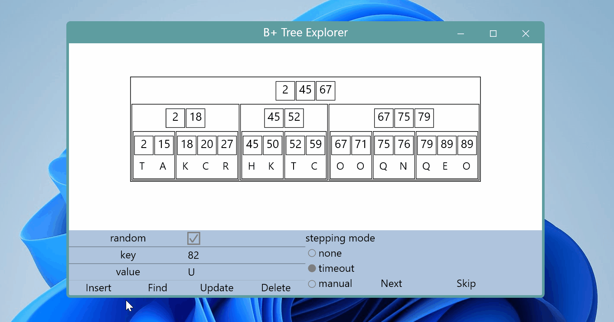
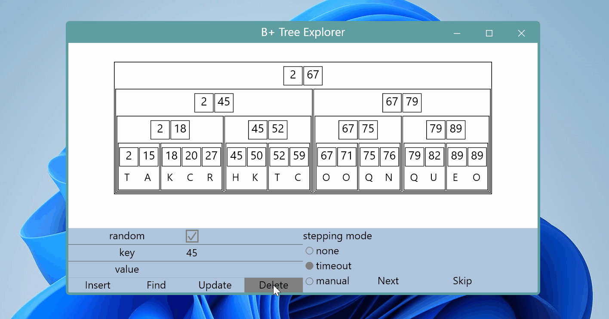

# BPlusTreeExplorer

An interactive visualization of B+ Tree written in C++ with GUI library *WndDesign*.

## Demo

Inserting 82：

Deleting 45:

## Build Steps

* Install Visual Studio 2022 with C++ development environment.

* Clone repositories: (put them in the same parent folder)

	* git clone https://github.com/hchenqi/WndDesign.git

	* git clone https://github.com/hchenqi/BPlusTreeExplorer.git
  
* Open `BPlusTreeExplorer\BPlusTreeExplorer.sln`, set `BPlusTreeExplorer` as startup project, build, and run.
